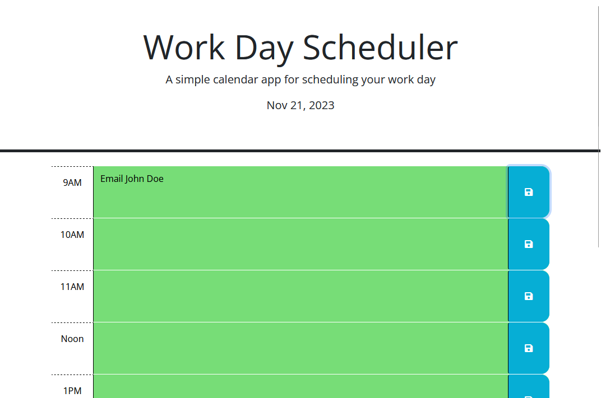

# Work-Day Scheduler

## Description

This application is a work-day time-management tool. Loading the page will display the current date. Below that, the user is provided a space in each hour of the typical work-day to type in tasks. The background of each hour block changes depending on the time of day you load the page to display past, present, and future in a visual manner, and any data saved is saved in localStorage.

Below is a screenshot of the website and a link to it.

[Website Link](https://purplepeopleeated.github.io/work-day-scheduler/)

## Usage

When the page loads, choose a time block to update with tasks. Typed-in tasks can be saved by clicking the save button of the task that was updated. These tasks will persist upon reloading the page so you don't lose anything!

## Credits

Articles Used:
- [MDN Docs](https://developer.mozilla.org/)
- [w3schools](https://www.w3schools.com/)
- [Day.js Docs](https://day.js.org/docs/en/)
- [jQuery Docs](https://api.jquery.com/)